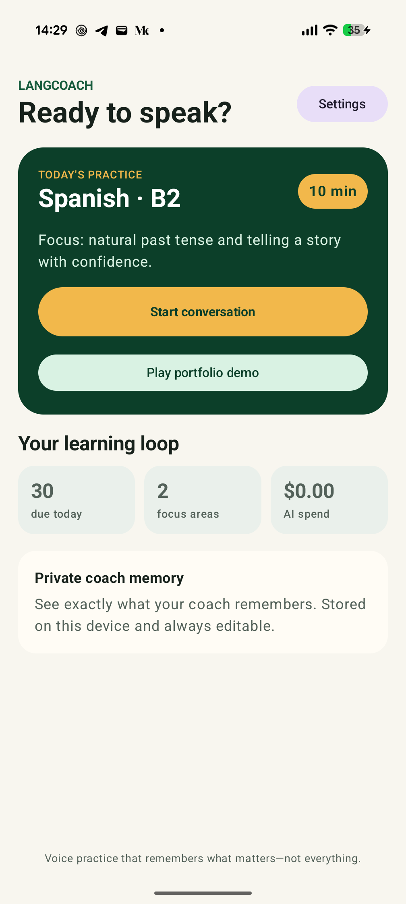
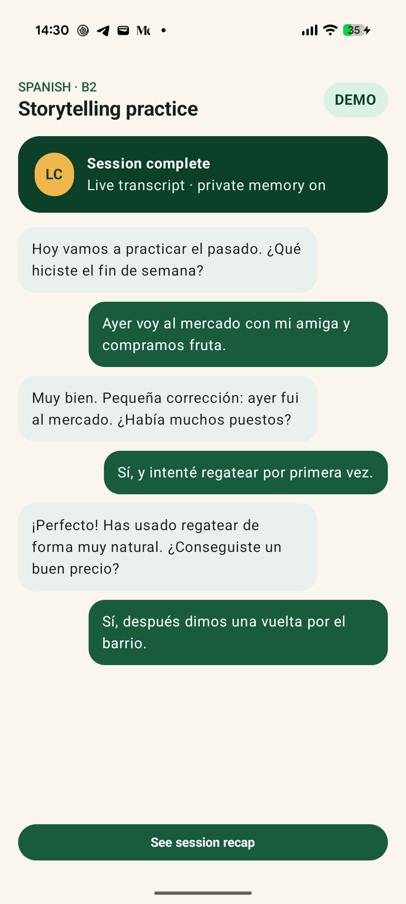
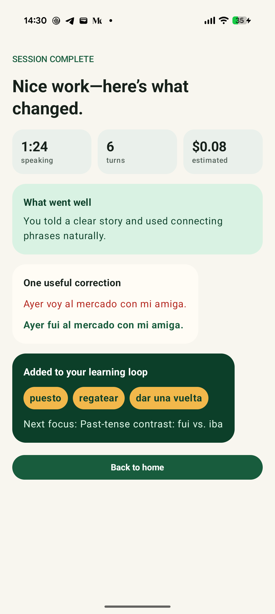
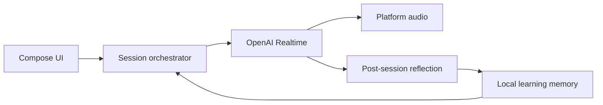

# LangCoach

**A local-first voice tutor that makes every conversation inform the next one.**

LangCoach is a Kotlin Multiplatform app for real-time language practice on Android and
iOS. It turns each conversation into vocabulary, recurring-error insights, and context
for the next lesson.

<p align="center">
  
  
  
</p>

## Highlights

- Real-time voice sessions with live, speaker-aware transcripts
- Post-session reflection, corrections, vocabulary review, and next-session planning
- Local Room database with editable coach memory and visible estimated API cost
- Shared Compose UI, domain logic, persistence, and model protocols
- Native Android audio with foreground-service support
- Native iOS audio through AVAudioEngine and secure Keychain storage
- Offline deterministic demo that requires no API key
- Versioned tutor prompts and a 12-case quality evaluation suite

## Architecture

The KMP modules separate core, data, domain, LLM, voice, and UI concerns. Ktor handles
model protocols, Koin provides dependency injection, and platform-specific code owns
audio capture, playback, and secure storage.



More detail is available in [architecture notes](docs/design.md), the
[demo walkthrough](docs/demo-script.md), and [tutor evaluation](docs/tutor-quality.md).

## Run

For the offline demo, open the project in Android Studio, run `androidApp`, and tap
**Play portfolio demo**.

For iOS, open `iosApp/iosApp.xcodeproj` in Xcode, select the `iosApp` scheme, and run it
on an iPhone simulator or device.

For a real voice session, add an OpenAI API key in **Settings**. The key remains in
platform secure storage and is never committed to the repository.

Completed voice-session transcripts remain in the local database. With a debuggable
Android build connected and authorized over USB, download the latest transcript as
JSON and Markdown with:

```bash
./scripts/export_android_transcripts.py
```

Pass `--all` to export every retained session. Exports are written to
`exports/transcripts/`, which is excluded from Git because transcripts contain private
conversation data.

```bash
./gradlew :androidApp:assembleDebug \
  :composeApp:testDebugUnitTest \
  :shared:domain:testDebugUnitTest
```

## Stack

Kotlin · Kotlin Multiplatform · Compose Multiplatform · Room · Ktor · Koin ·
OpenAI Realtime · AVAudioEngine

## License

[MIT](LICENSE) © 2026 Nikolai Konorev
