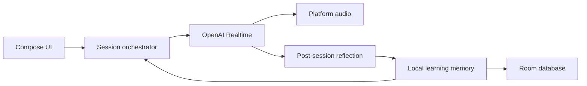

# LangCoach

**A privacy-conscious voice tutor that makes every conversation inform the next one.**

LangCoach is a Kotlin Multiplatform project for real-time language
practice. It listens, speaks, and—after a session—turns the conversation into useful
memory: vocabulary to revisit, recurring errors, and context for the next lesson.

The portfolio demo is deterministic and requires no API key. The real voice path connects
directly to OpenAI Realtime using a key stored on the device.

## Product walkthrough

<p align="center">
  
  
  
</p>

The offline demo shows the complete loop: a focused conversation, an in-context
correction, and a recap that turns the session into vocabulary and a concrete next focus.

## Why this project exists

Most conversational tutors forget the learner between calls or hide their learning model
behind a subscription backend. LangCoach explores a different trade-off:

- **Continuity:** recent sessions, due vocabulary, and weak grammar areas shape the next call.
- **Privacy:** the learning profile stays in the local Room database.
- **Transparency:** the learner can inspect and edit coach memory and see estimated API cost.
- **Direct ownership:** BYO-key traffic goes from the device to the model provider.

## The learning loop

1. Select one structured session objective from due vocabulary, recurring errors, and recent outcomes.
2. Stream microphone audio and model audio over a real-time WebSocket session.
3. Maintain a live, speaker-aware transcript.
4. Reflect on the ordered conversation to classify objective evidence, corrections, and vocabulary.
5. Validate the evidence, schedule future review, and use the result to shape the next conversation.



## Technical highlights

- Kotlin Multiplatform modules separate core, data, domain, LLM, voice, and UI concerns.
- Compose Multiplatform shares the product UI and presentation logic.
- Room stores session summaries, vocabulary, error categories, usage, and editable coach memory.
- Ktor handles chat and real-time model protocols.
- Koin wires shared and platform-specific implementations.
- Android uses low-level audio capture/playback and a foreground service for resilient calls.
- iOS uses AVAudioEngine for PCM streaming and Keychain for API-key storage.
- Focused common tests cover transcript reduction and vocabulary scheduling behavior.
- A persisted session plan and evidence-backed objective outcome close the learning loop.
- A versioned tutor prompt and live 12-case quality suite make coaching changes measurable.

See [docs/design.md](docs/design.md) for the reasoning behind the architecture and
[docs/demo-script.md](docs/demo-script.md) for the interview walkthrough. The teaching
strategy and evidence are documented in [docs/tutor-quality.md](docs/tutor-quality.md).

## Run the portfolio demo

1. Open the project in Android Studio.
2. Run the `androidApp` configuration.
3. Tap **Play portfolio demo**.
4. Let the scripted conversation complete, then open the session recap.

No network connection or API key is required for this path.

## Run a real voice session

Open **Settings**, add an OpenAI API key, choose the native and target languages, then
start a conversation. The key is stored using platform secure storage and is not committed
to the repository.

### iOS

1. Install Xcode 15 or later and select it with `xcode-select`.
2. Open `iosApp/iosApp.xcodeproj`.
3. Choose the `iosApp` scheme and an iPhone simulator or device.
4. Run the app and allow microphone access when starting the first live session.

The iOS target shares the Compose UI, navigation, domain logic, Room database, real-time
client, and learning loop. AVAudioEngine capture/playback and Keychain storage are native
iOS implementations.

```bash
./gradlew :androidApp:assembleDebug \
  :composeApp:testDebugUnitTest \
  :shared:domain:testDebugUnitTest
```

Run the real-model tutor quality suite:

```bash
python3 evals/tutor/run_eval.py \
  --output evals/tutor/results/$(date -u +%Y%m%dT%H%M%SZ).json
```

The previous `tutor-v1.0.0` baseline scored **4.83/5 across 12/12 passing cases**
with zero hard violations. The new session-plan prompt is versioned separately and must
establish a fresh reviewed baseline. See
[evals/tutor/README.md](evals/tutor/README.md) for the rubric, scenarios, and limits of
transcript-level evaluation.

## Product decisions

LangCoach is a mobile, local-first product prototype built to validate one idea:
a useful voice tutor should carry learning forward without turning every conversation into
cloud account data.

- **A complete mobile loop:** real-time voice practice, live transcription, structured
  reflection, vocabulary review, recurring-error tracking, and next-session planning.
- **Shared where it matters:** domain rules, persistence, model protocols, and most UI
  state live in KMP modules; latency-sensitive audio remains platform-specific.
- **Local by default:** there is no account system, analytics SDK, backend, or mandatory
  cloud sync. The learner can inspect and edit the memory stored on the device.
- **Evidence over magic:** session outcomes require transcript evidence, tutor behavior is
  versioned and evaluated, and estimated model cost stays visible.

The current vocabulary scheduler intentionally uses a small, testable FSRS-inspired model.
A production release would adopt a verified implementation and calibrate it with longitudinal
learning data. Android is the physically tested reference client; the iOS client now has a
runnable Xcode target and native audio and Keychain implementations.

## Roadmap

The next milestone is **cross-platform hardening**, not feature accumulation:

1. Validate iOS audio routing, interruptions, and background transitions on physical devices.
2. Expand real-time protocol and reflection-schema contract coverage.
3. Evaluate saved and live device audio for noise, latency, pacing, and prosody.
4. Replace the prototype scheduler with a verified FSRS implementation and calibration data.
5. Explore opt-in encrypted sync only if multi-device testing proves it improves the
   local-first experience.

## Stack

Kotlin · Kotlin Multiplatform · Compose Multiplatform · Room · Ktor · Koin ·
OpenAI Realtime · Android foreground services

## License

[MIT](LICENSE) © 2026 Nikolai Konorev
